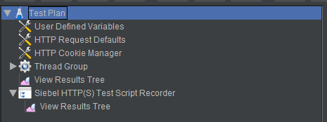
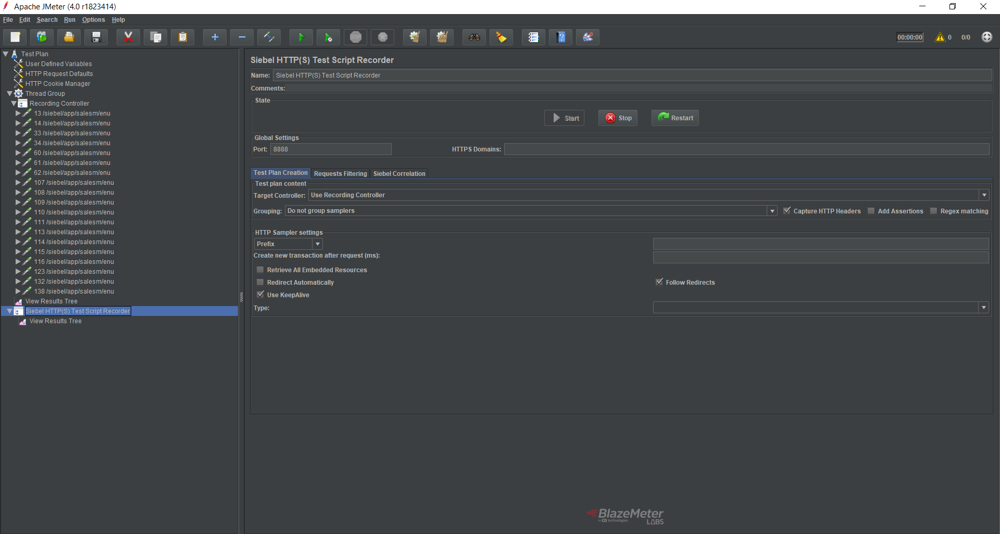
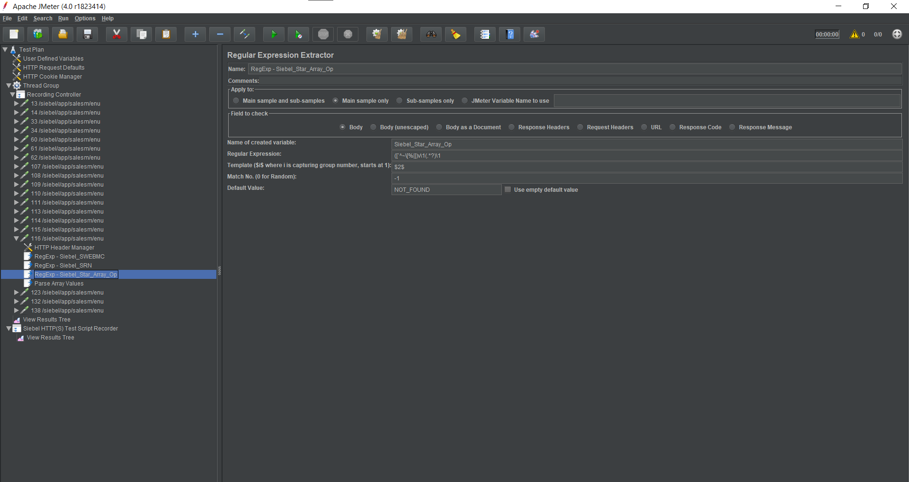
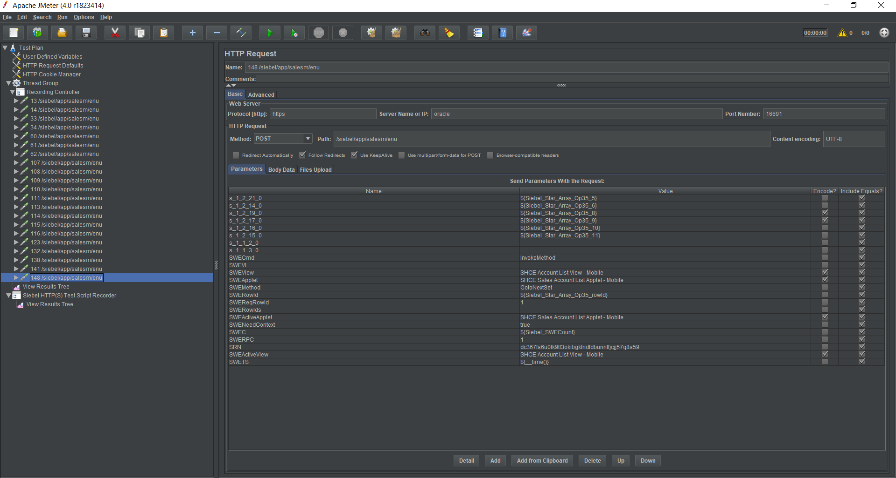

# JMeter-Siebel-plugin

This project implements a JMeter plugin to simplify the scripting of Siebel CRM applications by providing automatic correlations of variables at recording time.

After configuring the autocorrelation rules, you can start the recording like with the normal [HTTP(S) Test Script Recorder](http://jmeter.apache.org/usermanual/jmeter_proxy_step_by_step.html). The plugin will evaluate all the regular expressions against every sample result, and in case the regular expression matches, then, a Regular Expression Extractor will be added as a child element of the sampler.

The plugin will also apply the Request Regular Expression against the recorded samples and if there is an occurrence, then it will be replaced and parameterized using the corresponding *Reference name*.

## __splitStarArray

A custom JMeter function to parse Siebel Star Array strings is also available after installing the plugin.

The function receives two parameters, the string to split and the reference name (both without quotes) to store the variables, splits the string passed to it and returns the original string. The split strings are returned in the variables ${VAR_1}, ${VAR_2} etc. The count of variables is returned in ${VAR_n}.

The function searches for the number before an occurrence of "*", uses that value as the length of the number of characters to store, and then repeats if there is another occurrence of "*".

Example: 

${__splitStarArray(8\*testUser12\*testPassword6\*VRId-0, VAR)}

This will return the orginal string to split and set the following variables: 
* VAR_n=3 
* VAR_1=testUser 
* VAR_2=testPassword 
* VAR_3=VRId-0 

## Usage

### Using the plugin

A Siebel Recording Template is available to facilitate the script creation. Click on Files → Templates... and search for **Recording Siebel**.

The template will add below elements:

If you do not want to use the template, you can add the Siebel HTTP(S) Test Script Recorder element by right-clicking on the Test Plan element to get the Add menu: (Add → Non-Test Elements → Siebel HTTP(S) Test Script Recorder).

The plugin adds one element to JMeter:

Siebel HTTP(S) Test Script Recorder, which extends the default JMeter HTTP(S) Test Script Recorder.

 Test Script Recorder")

The Siebel HTTP(S) Test Script Recorder adds one tab **Siebel Correlation**, in which it is possible to specify the correlation rules you want to apply to the script that you are going to record.

The Siebel Correlation tab contains six columns, where five of them are used to configure the Regular Expression Extractor:

* *Reference Name / Name of created variable*. The name of the JMeter variable in which to store the result.
* *Request Regex*. Regular Expression that will be used to perform the autocorrelation.
* *Response Regex*. Regular Expression that will be set in the Regular Expression Extractor.
* *Match Number*. Indicates which match to use.
* *Match Group*. The number of the capturing group to be used.
* *Field to check*. Which field to check the regular expression against.
      * *The following fields can be checked: (from JMeter documentation):*
      * *Body* - the body of the response, e.g. the content of a web-page (excluding headers)
      * *Body (unescaped)* - the body of the response, with all Html escape codes replaced. Note that Html escapes are processed without regard of context, so some incorrect substitutions may be made. Note that this option highly impacts performances, so use it only when absolutely necessary and be aware of its impacts.
      * *Body as a Document* - extract text from various type of documents via Apache Tika. Note that Body as a Document option can impact performance, so ensure it is OK for your test.
      * *Request Headers* - the request header of the HTTP sampler.
      * *Response Headers* - the response header of the HTTP sampler.
      * *URL*
      * *Response Code* - e.g. 200
      * *Response Message* - e.g. OK

By default, the plugin includes a set of predefined rules to autocorrelate the most common Siebel dynamic values that need to be parameterized.

Some of the rules also consider the possibility that the server might return the response within dynamic regex boundaries, in example, the regex **cks([`^~\[%|])(.*?)\1** will search for either **`, ^, ~, [, % or |** as boundaries.

It is possible to add new rules by clicking on the *Add* button or *Edit* the predefined ones.

### Star Array Correlation

When the server returns variables using a star array, the plugin will parse the array and generate a new variable for each of the parameters, using the specified prefix name.

### Example

Suppose that it's required to record a Siebel workflow from the site [https://www.oracletest.com/siebel/app/salesm/enu](https://www.oracletest.com/siebel/app/salesm/enu).

In order to do that, the user should add a *Siebel HTTP(S) Test Script Recorder* element (from the *Non-Test Elements* menu ) to the Test Plan, instead of the classic *HTTP(S) Test Script Recorder*:

Then, the user should follow the same steps as recording with the classic *HTTP(S) Test Script Recorder*:

1. [Install the JMeter CA certificate](http://jmeter.apache.org/usermanual/component_reference.html#HTTP%28S%29_Test_Script_Recorder) (in order to record *HTTPS* requests).
2. Add a *Thread Group* element with a *Recording Controller* in it.
3. Set up the browser to use the proxy for all *HTTP* and *HTTPS* requests.
4. Click the *Start* button on the *Siebel HTTP(S) Test Script Recorder*.
5. Reproduce the workflow in the Siebel app (manually).

After this, the recorded requests appear in the *Recording Controller* just like in the normal HTTP(S) Recorder.

But looking at the requests, it can be seen that the regex extractors and the parameterized values have been added by the *Siebel HTTP(S) Test Script Recorder*:

 

## Compatibility
The plugin has been tested with Jmeter 3.2, 3.3 and 4.0 in Java 8 and 9.

Code base is implemented in Java 1.8, so lower versions of JVM are not supported.
 
## Contributing

If you find any issue or something that is not supported by this plugin, please report it and we will try to fix it. 

Otherwise you could [contribute](http://gitlab.abstracta.us/BZ/jmeter-siebel-plugin/blob/master/CONTRIBUTING.md) to the project.